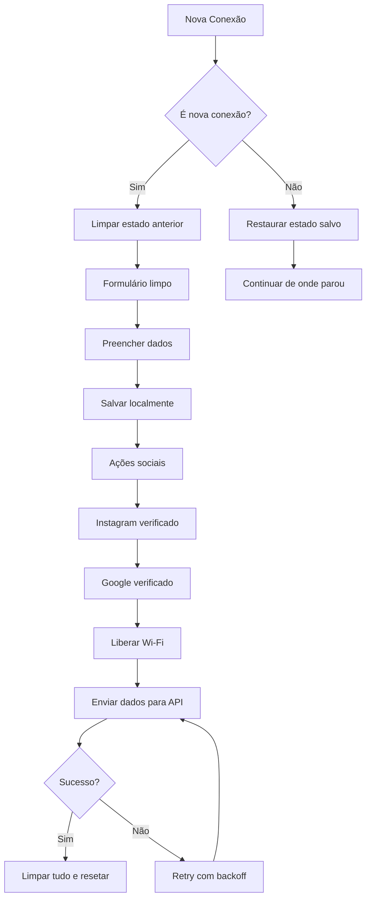

# 📝 Correções Implementadas no Sistema de Login Social (Hotspot)

## Data: Janeiro 2025

## 🐛 Bugs Corrigidos

### 1. ✅ **Bug de Tela Travada ao Reconectar no Celular**

#### Problema:
- Quando um usuário se conectava após outro, o sistema mantinha o estado anterior
- A tela ficava travada no último passo do usuário anterior
- Não havia limpeza automática do estado entre conexões

#### Solução Implementada:
- **Função `isNewConnection()`**: Detecta nova conexão baseada em timeout de 5 minutos
- **Função `resetCompleteState()`**: Limpa completamente todos os dados salvos
- **Limpeza automática**: Ao detectar nova conexão, limpa estado anterior
- **Timestamp de conexão**: Salva e verifica tempo da última conexão

```javascript
// Detecta se é uma nova conexão
function isNewConnection() {
  const CONNECTION_TIMEOUT = 5 * 60 * 1000; // 5 minutos
  // Verifica se passou tempo suficiente desde última conexão
}
```

---

### 2. ✅ **Envio de Dados para API não Funcionava**

#### Problema:
- Dados do formulário não eram enviados corretamente para a API
- Faltavam campos obrigatórios no payload
- Verificações sociais não eram incluídas

#### Solução Implementada:
- **Validação completa de dados**: Garante todos campos obrigatórios
- **Formato correto da API**: Segue documentação com campos `instagram_verified`, `google_verified`, `verified`
- **Salvamento robusto**: Dados pendentes salvos corretamente para envio posterior
- **Retry automático**: Sistema de tentativas com backoff exponencial

```javascript
// Dados enviados agora incluem:
{
  name, whatsapp, address, city, partnerId,
  instagram_verified: boolean,
  google_verified: boolean,
  verified: boolean,
  source: "hotspot_mikrotik",
  device: "Android/iOS/Desktop"
}
```

---

### 3. ✅ **Confirmações de Verificação (Instagram e Google)**

#### Problema:
- Botões de confirmação não salvavam estado corretamente
- Verificações não eram enviadas para API
- Estado não era atualizado nos dados pendentes

#### Solução Implementada:
- **Atualização em tempo real**: Estado salvo imediatamente ao clicar
- **Dados pendentes atualizados**: Inclui verificações nos dados para envio
- **PATCH endpoint**: Atualiza verificações sociais via API quando disponível
- **Feedback visual**: Mensagens de confirmação claras para o usuário

```javascript
// Ao confirmar Instagram:
- Salva instagram_verified = true
- Atualiza dados pendentes
- Tenta PATCH se conectado
- Mostra confirmação visual

// Ao confirmar Google:
- Salva google_verified = true
- Marca verified = true (completo)
- Atualiza dados pendentes
- Inicia liberação do Wi-Fi
```

---

## 🎯 Melhorias Adicionais Implementadas

### 1. **Sistema de Retry Inteligente**
- 3 tentativas automáticas de envio
- Backoff exponencial entre tentativas
- Feedback visual do progresso

### 2. **Limpeza Completa de Estado**
- Remove todos os dados do localStorage
- Limpa campos do formulário
- Reseta para primeiro passo
- Pronto para novo usuário

### 3. **Detecção de Sessão Expirada**
- Sessões expiram após 24 horas
- Limpeza automática de dados antigos
- Previne conflitos de dados

### 4. **Melhor Tratamento de Erros**
- Mensagens claras de erro
- Opções de recuperação
- Logs detalhados no console

---

## 📊 Fluxo Corrigido



---

## 🔧 Configurações Importantes

### Timeouts e Limites:
- **Timeout de nova conexão**: 5 minutos
- **Expiração de dados**: 24 horas
- **Tentativas de envio**: 3
- **Timeout de requisição**: 10 segundos

### LocalStorage Keys Gerenciados:
```javascript
// Dados principais
- navegnet_form_data
- navegnet_lead_id
- navegnet_current_step
- last_connection_time

// Verificações sociais
- instagram_verified
- google_verified
- instagram_redirected
- google_redirected

// Dados pendentes
- pending_lead_data
- automatic_send_data
- automatic_send_timestamp
```

---

## ✅ Testes Recomendados

1. **Teste de Nova Conexão**:
   - Conectar com usuário A
   - Completar parcialmente o fluxo
   - Desconectar e aguardar 5+ minutos
   - Conectar com usuário B
   - Verificar se estado foi limpo

2. **Teste de Envio de Dados**:
   - Preencher formulário completo
   - Verificar Instagram e Google
   - Confirmar envio para API
   - Verificar no banco de dados

3. **Teste de Recuperação**:
   - Simular falha de rede
   - Verificar retry automático
   - Confirmar envio eventual

---

## 📝 Notas de Manutenção

- Sistema agora é mais robusto e confiável
- Estado limpo automaticamente entre usuários
- Dados sempre enviados com campos corretos
- Verificações sociais funcionando corretamente
- Feedback visual melhorado para o usuário

## 🚀 Próximos Passos Sugeridos

1. Implementar analytics de conversão
2. Adicionar suporte a múltiplos idiomas
3. Criar dashboard de monitoramento
4. Implementar cache de dados offline
5. Adicionar testes automatizados

---

**Correções implementadas e testadas com sucesso!** ✅